<p align="center">
  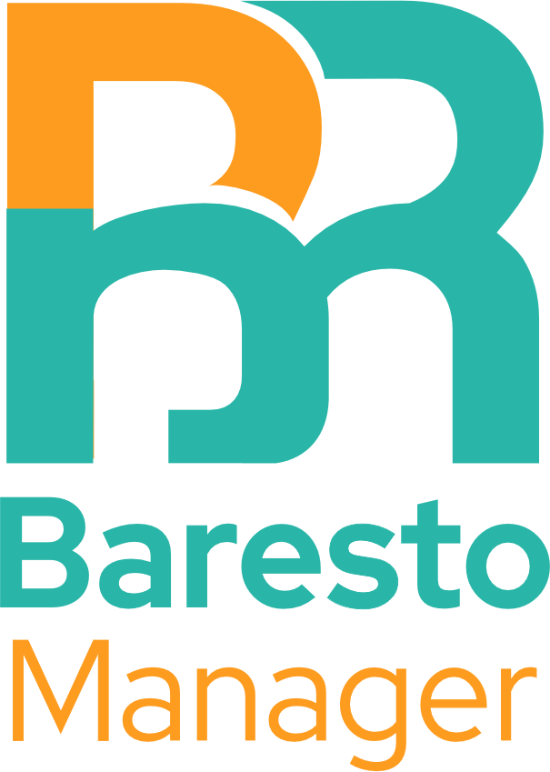
</p>

# Baresto Manager

**EN:** Lightweight restaurant operating system — digital QR menus, waiter ordering, kitchen display (KDS), manager dashboard, and real-time updates.

**EL:** Ελαφρύ σύστημα διαχείρισης εστιατορίου — ψηφιακά μενού QR, παραγγελίες σερβιτόρων, οθόνη κουζίνας (KDS), πίνακας διαχείρισης και ενημερώσεις σε πραγματικό χρόνο.

---

## Screenshots / Στιγμιότυπα

**EN:** Staff interface on desktop and mobile (waiter ordering on a phone over Wi‑Fi), guest QR menu preview and printout, and what customers see after scanning a table QR.

**EL:** Διεπαφή προσωπικού σε desktop και κινητό (παραγγελία σερβιτόρου από τηλέφωνο στο Wi‑Fi), προεπισκόπηση και εκτύπωση QR μενού επισκεπτών, και η εμπειρία πελάτη μετά το σκάναρισμα QR τραπεζιού.

### Desktop

| Kitchen (KDS) | Menu management |
| :---: | :---: |
| 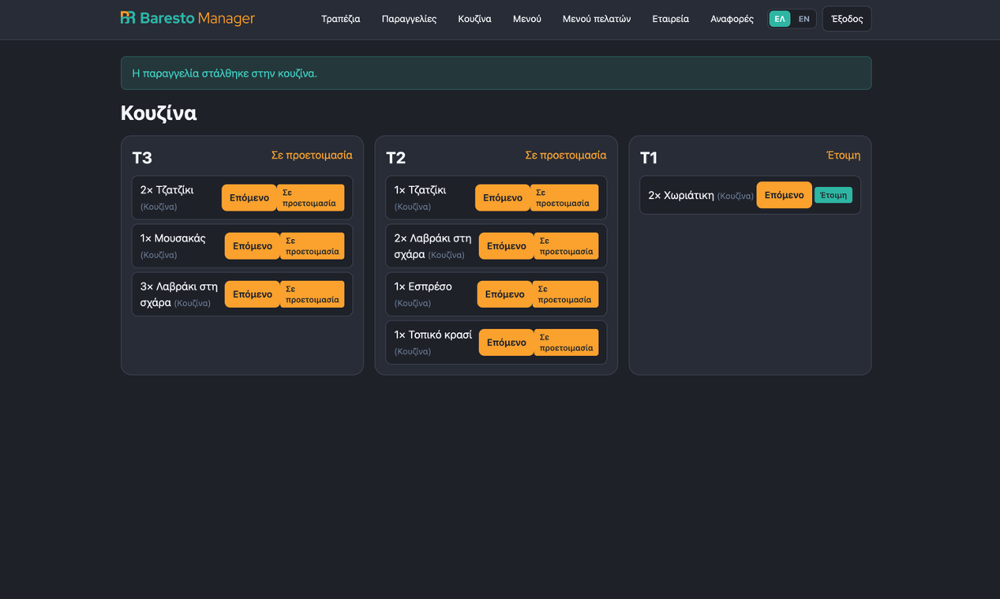 | 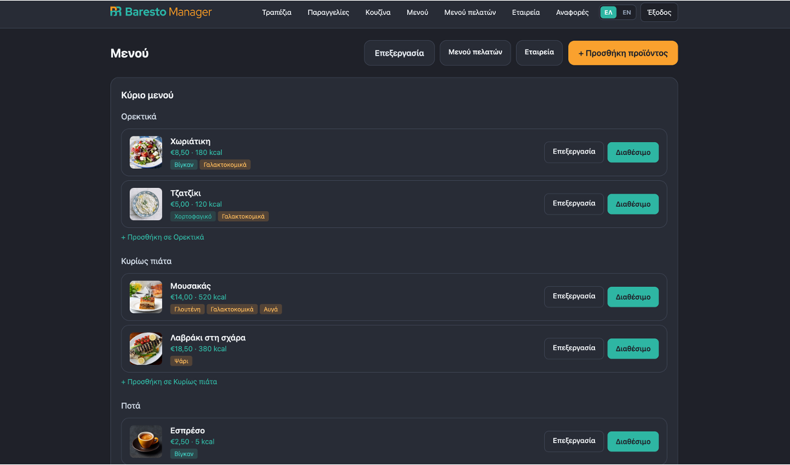 |

| Floor plan | Tables list |
| :---: | :---: |
| 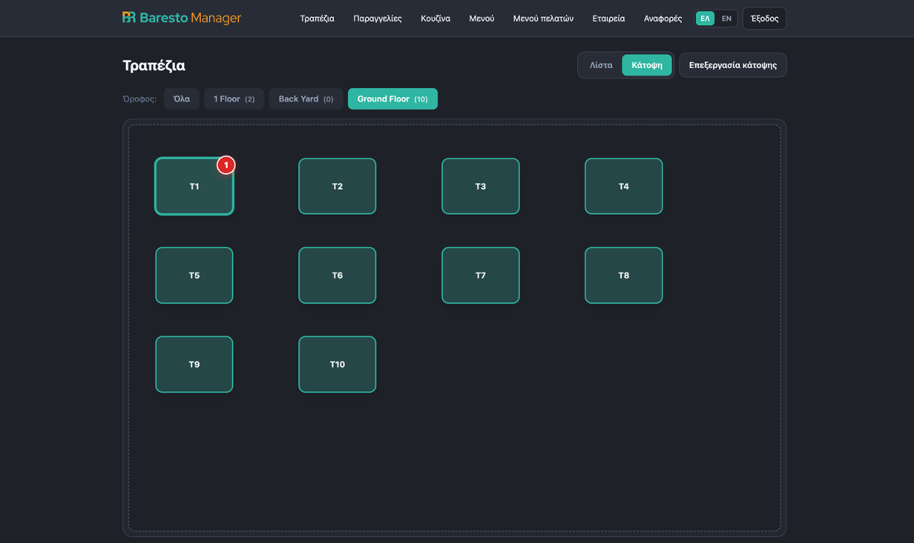 | 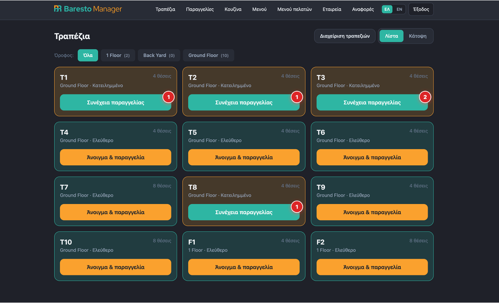 |

| Guest menu & QR hub | Guest waiter call alert |
| :---: | :---: |
| 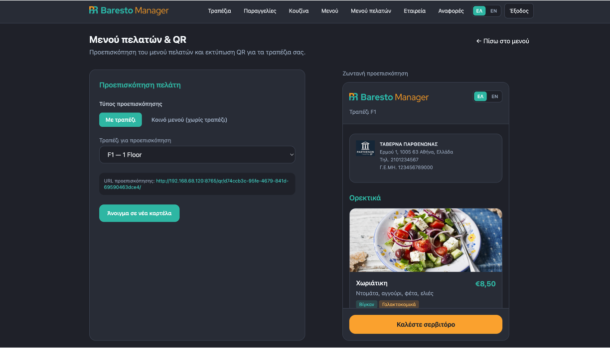 | 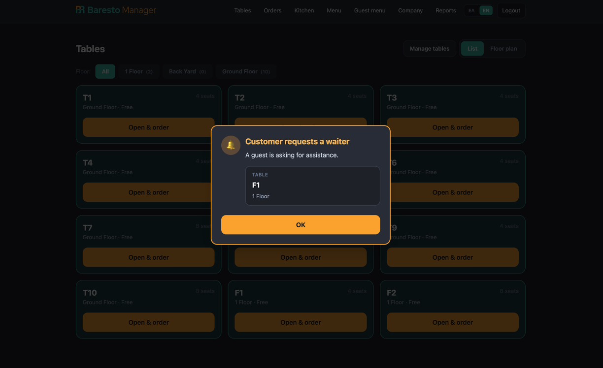 |

| Printed QR menu cards |
| :---: |
|  |

### Mobile (waiter)

| Order flow | Tables |
| :---: | :---: |
| 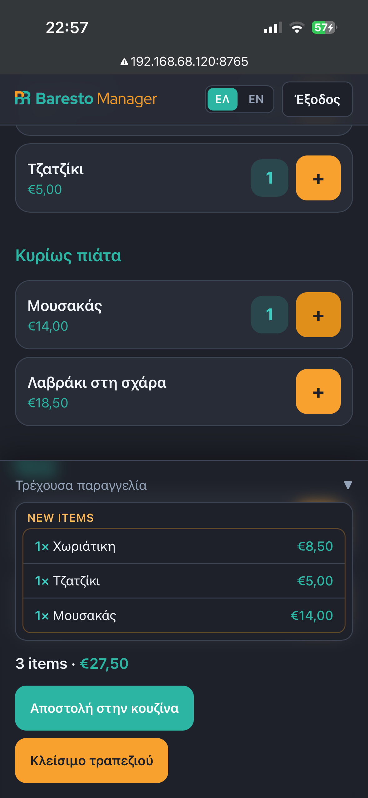 | 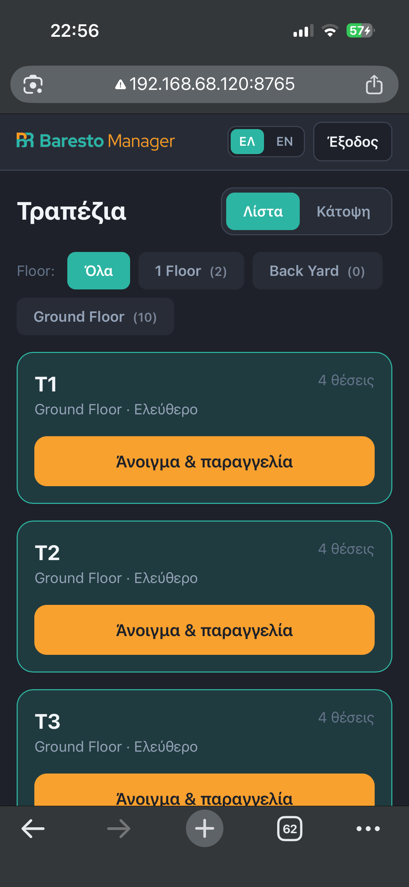 |

### Customer (QR menu)

**EN:** What guests see on their phone after scanning the table QR — bilingual menu, allergens, and **Call waiter**.

**EL:** Τι βλέπουν οι πελάτες στο κινητό μετά το σκάναρισμα QR τραπεζιού — δίγλωσσο μενού, αλλεργιογόνα και **Καλέστε σερβιτόρο**.

| Menu & starters (EN) | Main dishes (ΕΛ) |
| :---: | :---: |
| 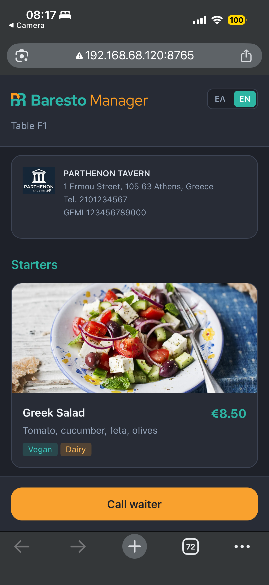 | 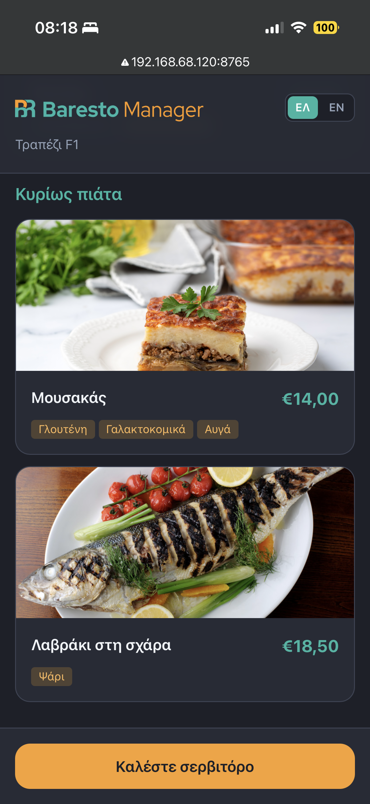 |

---

## Contents / Περιεχόμενα

- [Screenshots / Στιγμιότυπα](#screenshots--στιγμιότυπα)
- [User guide (HTML) / Οδηγός χρήσης](docs/user-guide.html)
- [English](#english)
  - [Running on Windows (beginners)](#running-on-windows-beginners)
  - [Windows one-click launcher](#windows-one-click-launcher)
  - [Running on macOS / Linux](#running-on-macos--linux)
  - [Configuration](#configuration-env)
  - [Development server](#development-server)
- [Ελληνικά](#ελληνικά)
  - [Εκτέλεση σε Windows (αρχάριοι)](#εκτέλεση-σε-windows-αρχάριοι)
  - [Εκκίνηση με ένα κλικ (Windows)](#εκκίνηση-με-ένα-κλικ-windows)
  - [Εκτέλεση σε macOS / Linux](#εκτέλεση-σε-macos--linux)
  - [Ρυθμίσεις](#ρυθμίσεις-env)
  - [Εκκίνηση server](#εκκίνηση-server)

---

## English

### Tech stack

| Layer | Technology |
|-------|------------|
| Backend | Python 3.12+, Django 5, Django REST Framework |
| Real-time | Django Channels 4, Daphne, Redis (production) |
| Database | SQLite (local) / PostgreSQL (production) |
| Staff UI | Django templates, HTMX, Alpine.js, Tailwind CSS |
| API auth | JWT (SimpleJWT) |
| i18n | Greek (default) + English — UI and menu content |

### Requirements

- Python 3.12 or newer (installed automatically on Windows by [`Start-BarestoManager.bat`](Start-BarestoManager.bat) when possible)
- `pip` and `venv`
- Optional: Docker & Docker Compose for PostgreSQL + Redis

**Windows users:** see [Quick start (3 steps)](#quick-start-3-steps) — no Command Prompt required.

### Running on Windows (beginners)

This section is for a **plain Windows 10 or 11 PC** — no programming background assumed. The demo database and images are **already included**; you do not need PostgreSQL, Redis, or Docker for a local trial.

#### Quick start (3 steps)

1. **Download the project** — GitHub → green **Code** → **Download ZIP** → extract to e.g. `Documents\baresto_manager`.
2. **Double-click** **`Start-BarestoManager.bat`** in that folder (same level as `manage.py`).
3. **Wait for the browser** — the launcher sets everything up on first run and opens **http://127.0.0.1:8765/login/** automatically.

Leave the black console window **open** while you use the app. Press **Ctrl + C** in that window to stop the server.

Log in with a demo account — see [Demo accounts](#demo-accounts) (e.g. waiter: `waiter` / `waiter1234`, or PIN `2222` at `/login/pin/`).

On **every later run**, double-click **`Start-BarestoManager.bat`** again (setup is skipped after the first time).

#### What you need

| Item | Details |
|------|---------|
| **Computer** | Windows 10 or 11 (64-bit) |
| **Internet** | First run only — downloads Python (if needed) and Python libraries (~5–15 minutes) |
| **Disk space** | About **500 MB** free |
| **Browser** | Microsoft Edge, Chrome, or Firefox |
| **Optional — phone/tablet** | Same Wi‑Fi as the PC for the waiter app |

You do **not** need: a server, a credit card, Linux, Docker, or prior coding experience.

The launcher tries to install **Python 3.12** automatically via `winget` if it is missing. If that fails, see [Install Python manually](#install-python-manually-one-time) below.

#### Get the project files (one time)

**Option A — Download ZIP (easiest)**

1. Open the project page on GitHub in your browser.
2. Click the green **Code** button → **Download ZIP**.
3. Right-click the ZIP → **Extract All…** → choose e.g. `Documents\baresto_manager`.

**Option B — Git**

If you already use Git, clone the repository into a folder such as `Documents\baresto_manager`.

#### Install Python manually (one time)

Only needed if the launcher cannot install Python for you.

1. Open **https://www.python.org/downloads/windows/** in your browser.
2. Download **Python 3.12** or newer.
3. Run the installer.
4. On the **first** screen, turn on **“Add python.exe to PATH”** (bottom checkbox) — this is important.
5. Click **Install Now** and wait until it finishes.

Check: **Win + R** → `cmd` → Enter → `python --version` — you should see `Python 3.12.x`.

#### Manual setup (Command Prompt)

If you prefer not to use the batch launcher:

**First time:**

```bat
cd Documents\baresto_manager
python -m venv .venv
.venv\Scripts\activate
pip install -r requirements\local.txt
copy .env.example .env
python manage.py runserver
```

**Every time after:**

```bat
cd Documents\baresto_manager
.venv\Scripts\activate
python manage.py runserver
```

Then open **http://127.0.0.1:8765/login/** in your browser.

#### Windows one-click launcher

| File | Purpose |
|------|---------|
| [`Start-BarestoManager.bat`](Start-BarestoManager.bat) | **Recommended** — setup + run; installs Python via `winget` if needed |
| [`BarestoManager.exe`](BarestoManager.exe) | Same behaviour as a single `.exe` — [build on Windows](#build-barestomanagerexe) |
| [`scripts/windows/baresto_launcher.py`](scripts/windows/baresto_launcher.py) | Launcher source (used by the `.bat` and `.exe`) |

**What the launcher does automatically**

1. Finds the project folder (`manage.py`)
2. Installs Python 3.12 via `winget` if missing (or opens python.org)
3. Creates `.venv` and runs `pip install -r requirements/local.txt` (first run only)
4. Copies `.env.example` → `.env` if needed, runs database migrations
5. Starts the dev server on port **8765**
6. Opens the login page in your default browser

More detail: [`scripts/windows/README.md`](scripts/windows/README.md).

##### Build `BarestoManager.exe`

The `.exe` must be built **on a Windows PC** (PyInstaller cannot cross-compile from macOS/Linux). After extracting the project:

```bat
cd scripts\windows
build-exe.bat
```

This copies **`BarestoManager.exe`** to the project root. Place it next to `manage.py` and double-click. Distribute the **whole project folder** (ZIP) together with the exe — the exe is a launcher, not a standalone app bundle.

#### Phone or tablet on the same Wi‑Fi (optional)

1. PC and phone on the **same home Wi‑Fi** (not guest network).
2. In Command Prompt, type `ipconfig` and note your PC’s **IPv4 Address** (e.g. `192.168.1.15`).
3. If Windows asks to allow **Python** through the firewall, choose **Allow** on private networks.
4. On the phone browser, open: `http://<IPv4-ADDRESS>:8765/login/pin/` (example: `http://192.168.1.15:8765/login/pin/`).

#### If something goes wrong

| Problem | What to try |
|---------|-------------|
| `'python' is not recognized` | Install Python with **Add python.exe to PATH**, or let the launcher use `winget`; open a **new** window after install. |
| `'pip' is not recognized` | Use `python -m pip install -r requirements\local.txt` instead of `pip install …`. |
| `manage.py` not found | Run `Start-BarestoManager.bat` from the folder that contains `manage.py`, not from inside `scripts\`. |
| Page does not load | Make sure the server window is still open; use port **8765**, not 8000. |
| Phone cannot connect | Same Wi‑Fi, firewall allows Python, use the PC’s IPv4 address from `ipconfig`. |
| Port already in use | Close the other app on 8765, or change `DJANGO_PORT` in `.env`. |

For a fresh empty database instead of the bundled demo, see [Quick start (local)](#quick-start-local) below.

### Running on macOS / Linux

For **macOS** (Apple Silicon or Intel) or **Linux** (Ubuntu, Debian, Fedora, etc.) — no prior coding experience assumed. The demo database and images are **already included**; PostgreSQL, Redis, and Docker are optional.

#### What you need

| Item | Details |
|------|---------|
| **Computer** | Mac (macOS 12+) or Linux PC (64-bit) |
| **Internet** | First-time download of Python and project files (~5 minutes) |
| **Disk space** | About **500 MB** free |
| **Browser** | Safari, Chrome, Firefox, or Edge |
| **Optional — phone/tablet** | Same Wi‑Fi as the computer for the waiter app |

You do **not** need: a cloud server or paid hosting for a local trial.

#### Install Python (one time)

**macOS**

1. Open **https://www.python.org/downloads/macos/** and download **Python 3.12** or newer.
2. Open the `.pkg` installer and follow the prompts (defaults are fine).
3. Open **Terminal** (Spotlight: **Cmd + Space**, type `Terminal`, Enter) and check:

```bash
python3 --version
```

**Alternative (developers):** [Homebrew](https://brew.sh/) — `brew install python@3.12`

**Linux (Ubuntu / Debian)**

```bash
sudo apt update
sudo apt install python3 python3-venv python3-pip
python3 --version
```

**Linux (Fedora)**

```bash
sudo dnf install python3 python3-pip
python3 --version
```

On other distributions, install **Python 3.12+** and a `venv` module from your package manager.

#### Get the project files (one time)

**Option A — Download ZIP**

1. Open the project on GitHub → **Code** → **Download ZIP**.
2. Unzip to e.g. `~/Documents/baresto_manager`.

**Option B — Git**

```bash
cd ~/Documents
git clone https://github.com/atzounis/baresto_manager.git
cd baresto_manager
```

#### Start the app (first time)

1. Open **Terminal**.
2. Go to the project folder (adjust the path if needed):

```bash
cd ~/Documents/baresto_manager
```

3. Run **one line at a time**. The first `pip install` may take several minutes.

```bash
python3 -m venv .venv
source .venv/bin/activate
pip install -r requirements/local.txt
cp .env.example .env
python manage.py runserver
```

4. Leave Terminal **open** while using the app. When you see “Starting development server”, open:

**http://127.0.0.1:8765/login/**

5. Log in with a demo account — see [Demo accounts](#demo-accounts) (e.g. waiter: `waiter` / `waiter1234`, PIN `2222` at `/login/pin/`).

Stop the server: **Ctrl + C** in Terminal.

#### Start the app (every time after)

```bash
cd ~/Documents/baresto_manager
source .venv/bin/activate
python manage.py runserver
```

Then open **http://127.0.0.1:8765/login/**.

#### Phone or tablet on the same Wi‑Fi (optional)

1. Computer and phone on the **same Wi‑Fi** (not guest network).
2. Find your computer’s LAN address:
   - **macOS:** `ipconfig getifaddr en0` (Wi‑Fi) or check **System Settings → Network**
   - **Linux:** `hostname -I | awk '{print $1}'` or `ip -4 addr show`
3. On the phone, open: `http://<LAN-IP>:8765/login/pin/` (example: `http://192.168.1.42:8765/login/pin/`).

On macOS, allow **Python** through the firewall if prompted. On Linux, ensure port **8765** is not blocked by `ufw` or similar.

#### If something goes wrong

| Problem | What to try |
|---------|-------------|
| `python3: command not found` | Install Python (see above) or use the full path from `which python3`. |
| `ensurepip` / venv errors on Linux | Install the `python3-venv` package (`sudo apt install python3-venv`). |
| `pip install` fails on newer Ubuntu | Use the virtualenv above; do not install into system Python. |
| Page does not load | Keep `runserver` running; use port **8765**, not 8000. |
| Phone cannot connect | Same Wi‑Fi, correct LAN IP, firewall allows the server. |

For a fresh empty database instead of the bundled demo, see [Quick start (local)](#quick-start-local) below.

### Quick start (local)

```bash
# 1. Clone and enter the project
cd baresto_manager

# 2. Virtual environment
python3 -m venv .venv
source .venv/bin/activate          # Windows: .venv\Scripts\activate

# 3. Dependencies
pip install -r requirements/local.txt

# 4. Environment (copy and adjust port / URLs if needed)
cp .env.example .env

# 5. Run development server (pre-seeded db.sqlite3 + media/ included)
python manage.py runserver
```

Open **http://127.0.0.1:8765/login/** — see [Development server](#development-server) below.

To start from an empty database instead:

```bash
python manage.py migrate
python manage.py seed_demo
python manage.py generate_qr_codes
python manage.py runserver
```

Open **http://127.0.0.1:8765/login/** — see [Development server](#development-server) below.

### Configuration (.env)

Copy `.env.example` to `.env` and adjust as needed.

| Variable | Default | Purpose |
|----------|---------|---------|
| `DJANGO_SETTINGS_MODULE` | `config.settings.local` | Settings module |
| `SECRET_KEY` | *(change in production)* | Django secret key |
| `DEBUG` | `True` | Debug mode (local) |
| `ALLOWED_HOSTS` | `localhost,127.0.0.1` | Allowed HTTP hosts (see phone access below) |
| `ALLOWED_HOSTS_EXTRA` | *(empty)* | Extra hosts, comma-separated |
| `DJANGO_BIND` | `0.0.0.0` | Listen address (`0.0.0.0` = LAN devices can connect) |
| `DJANGO_PORT` | `8765` | Local dev server port (not Django’s 8000) |
| `SITE_BASE_URL` | `http://127.0.0.1:8765` | Public base URL for QR codes and links |
| `CSRF_TRUSTED_ORIGINS` | *(auto in local)* | Override CSRF origins if needed |
| `DATABASE_URL` | SQLite file | Database connection |
| `REDIS_URL` | `redis://127.0.0.1:6379/1` | Redis (cache / channels) |
| `USE_INMEMORY_CHANNELS` | `True` | In-memory WebSockets locally; set `False` with Redis |

`SITE_BASE_URL` must match how you reach the app (host + port). After changing it, regenerate QR images:

```bash
python manage.py generate_qr_codes
```

### Development server

The project uses **port 8765** by default instead of Django’s **8000**, so it does not clash with other local apps.

| Command | Result |
|---------|--------|
| `python manage.py runserver` | Starts on `0.0.0.0:8765` (`DJANGO_BIND` + `DJANGO_PORT` from `.env`) |
| `python manage.py runserver 127.0.0.1:9000` | Explicit host/port (overrides default) |

Change the default port in `.env`:

```env
DJANGO_PORT=9000
SITE_BASE_URL=http://127.0.0.1:9000
```

Restart `runserver` after editing `.env`, then run `generate_qr_codes` if you use printed QR menus.

### Phone / tablet on the same Wi‑Fi (waiter device)

`config/settings/local.py` automatically:

- Adds your Mac’s **LAN IP** to `ALLOWED_HOSTS`
- Builds **`CSRF_TRUSTED_ORIGINS`** for login from a phone

1. Mac and phone on the **same Wi‑Fi** (not guest).
2. In `.env`, keep `DJANGO_BIND=0.0.0.0`.
3. Allow **Python** incoming in **LuLu** (or your firewall).
4. Find your Mac IP: `ipconfig getifaddr en0`
5. On the phone, open: `http://<MAC-IP>:8765/login/pin/` (waiter PIN: `2222`).

Optional — set QR / public URL to the LAN address:

```env
SITE_BASE_URL=http://192.168.1.42:8765
ALLOWED_HOSTS_EXTRA=192.168.1.42
```

Check detected hosts:

```bash
python manage.py shell -c "from django.conf import settings; print(settings.ALLOWED_HOSTS)"
```

### Demo accounts

| Role | Username | Password | PIN |
|------|----------|------------|-----|
| Admin | `admin` | `admin1234` | `0000` |
| Manager | `manager` | `manager1234` | `1111` |
| Waiter | `waiter` | `waiter1234` | `2222` |
| Kitchen | `kitchen` | `kitchen1234` | `3333` |
| Cashier | `cashier` | `cashier1234` | `4444` |

- **Password login:** `/login/`
- **PIN login (shared tablet):** `/login/pin/`

### Main features by role

| Role | What they can do |
|------|------------------|
| **Waiter** | View tables, open sessions, take orders (+ quantity badges, live order drawer), send to kitchen, close table (bill + free table) |
| **Kitchen** | KDS — see incoming orders, update item status (real-time WebSocket) |
| **Manager** | Menu & categories (bilingual), company legal details, guest menu preview, QR print, tables/floors, floor plan, reports |
| **Admin** | Everything managers can do, plus **staff user management** (`/staff/users/`) |

### Key URLs

| Path | Description |
|------|-------------|
| `/login/` | Staff password login |
| `/login/pin/` | PIN quick login |
| `/dashboard/` | Manager dashboard |
| `/tables/` | Table list & floor plan (filter by floor) |
| `/orders/new/<session_id>/` | Waiter ordering |
| `/kitchen/` | Kitchen display |
| `/menu/` | Menu management |
| `/menu/guest/` | Guest menu preview & QR printing |
| `/company/` | Company / legal catalogue (guest menu) |
| `/staff/users/` | Staff users (**admin only**) |
| `/qr/<table-uuid>/` | Public guest menu (per table) |
| `/qr/menu/<restaurant-uuid>/` | Shared guest menu (no table) |
| `/api/v1/` | REST API |
| `/admin/` | Django admin |

### UI language (ΕΛ / EN)

The app interface defaults to **Greek**. Use the **ΕΛ / EN** switcher in the navigation bar.

After changing translatable strings in templates:

```bash
python manage.py makemessages -l el --ignore=.venv
# Edit locale/el/LC_MESSAGES/django.po
python manage.py compilemessages -l el
```

### Menu content (Greek & English)

Dish names, descriptions, and categories are stored per language (`name_el`, `name_en`, etc.) via **django-modeltranslation**.

- Edit products at `/menu/items/<id>/edit/` (Greek + English fields)
- Or use Django admin

Sync legacy single-language data:

```bash
python manage.py sync_menu_translations
```

### Guest QR codes

1. Log in as **manager** or **admin**
2. Go to **Guest menu** (`/menu/guest/`)
3. Preview the customer view
4. Print either:
   - **One QR for all tables** — same menu URL everywhere
   - **QR per table** — includes table name on menu and printout

Set `SITE_BASE_URL` in `.env` to your public URL (scheme + host + port) so printed QR codes work on phones. See [Configuration (.env)](#configuration-env).

### Tables & floors

- **Manage tables** — add/edit/delete tables, set seat count
- **+ Add floor** — modal to create floors; filter tables by floor
- **Floor plan** — drag tables, save layout

### Management commands

```bash
python manage.py seed_demo              # Demo restaurant, menu, staff, tables
python manage.py generate_qr_codes      # Regenerate table QR images
python manage.py rotate_qr_tokens       # New QR tokens (invalidates old links)
python manage.py sync_menu_translations
python manage.py close_stale_orders --hours 8
python manage.py export_daily_report --date 2026-05-23
python manage.py compilemessages -l el
```

### Docker (production-like)

```bash
cp .env.example .env
```

Edit `.env`:

```env
DATABASE_URL=postgres://baresto:baresto@db:5432/baresto
REDIS_URL=redis://redis:6379/1
USE_INMEMORY_CHANNELS=False
DJANGO_PORT=8765
SITE_BASE_URL=http://127.0.0.1:8765
```

```bash
docker compose up --build
```

App URL: **http://127.0.0.1:8765**

### Tests

```bash
pytest
```

### Brand logos

Copy logos into `static/brand/` (see `static/brand/README.md`):

```bash
cp images/barestomanager-horizontal-logo.png static/brand/baresto-horizontal.png
cp images/barestomanager-vertical-logo.png static/brand/baresto-vertical.png
```

---

## Ελληνικά

### Τεχνολογίες

| Επίπεδο | Τεχνολογία |
|---------|------------|
| Backend | Python 3.12+, Django 5, Django REST Framework |
| Real-time | Django Channels 4, Daphne, Redis (παραγωγή) |
| Βάση δεδομένων | SQLite (τοπικά) / PostgreSQL (παραγωγή) |
| UI προσωπικού | Django templates, HTMX, Alpine.js, Tailwind CSS |
| API | JWT (SimpleJWT) |
| Γλώσσες | Ελληνικά (προεπιλογή) + Αγγλικά — διεπαφή και μενού |

### Απαιτήσεις

- Python 3.12 ή νεότερο (εγκαθίσταται αυτόματα σε Windows από το [`Start-BarestoManager.bat`](Start-BarestoManager.bat) όπου είναι δυνατό)
- `pip` και `venv`
- Προαιρετικά: Docker & Docker Compose για PostgreSQL + Redis

**Windows:** δείτε [Γρήγορη εκκίνηση (3 βήματα)](#γρήγορη-εκκίνηση-3-βήματα) — χωρίς Command Prompt.

### Εκτέλεση σε Windows (αρχάριοι)

Αυτή η ενότητα απευθύνεται σε **απλό PC με Windows 10 ή 11** — χωρίς προγραμματιστικές γνώσεις. Η demo βάση και οι εικόνες **περιλαμβάνονται ήδη**· δεν χρειάζεται PostgreSQL, Redis ή Docker για δοκιμή στον υπολογιστή σας.

#### Γρήγορη εκκίνηση (3 βήματα)

1. **Λήψη project** — GitHub → πράσινο **Code** → **Download ZIP** → εξαγωγή π.χ. σε `Documents\baresto_manager`.
2. **Διπλό κλικ** στο **`Start-BarestoManager.bat`** στον φάκελο (δίπλα στο `manage.py`).
3. **Περιμένετε τον browser** — ο launcher κάνει όλη την εγκατάσταση την πρώτη φορά και ανοίγει αυτόματα το **http://127.0.0.1:8765/login/**.

Αφήστε το **μαύρο παράθυρο κονσόλας ανοιχτό** όσο χρησιμοποιείτε την εφαρμογή. **Ctrl + C** στο παράθυρο για διακοπή του server.

Σύνδεση με demo λογαριασμό — [Λογαριασμοί επίδειξης](#λογαριασμοί-επίδειξης) (π.χ. σερβιτόρος: `waiter` / `waiter1234`, PIN `2222` στο `/login/pin/`).

**Κάθε επόμενη φορά:** ξανά διπλό κλικ στο **`Start-BarestoManager.bat`** (η εγκατάσταση γίνεται μόνο την πρώτη φορά).

#### Τι χρειάζεστε

| Στοιχείο | Λεπτομέρειες |
|----------|--------------|
| **Υπολογιστής** | Windows 10 ή 11 (64-bit) |
| **Internet** | Μόνο την πρώτη φορά — Python (αν λείπει) και βιβλιοθήκες (~5–15 λεπτά) |
| **Χώρος δίσκου** | Περίπου **500 MB** ελεύθερα |
| **Browser** | Microsoft Edge, Chrome ή Firefox |
| **Προαιρετικά — κινητό/tablet** | Ίδιο Wi‑Fi με τον PC για εφαρμογή σερβιτόρου |

Δεν χρειάζεστε: server, πιστωτική κάρτα, Linux, Docker ή προηγούμενη εμπειρία προγραμματισμού.

Ο launcher προσπαθεί να εγκαταστήσει **Python 3.12** αυτόματα μέσω `winget`. Αν αποτύχει, δείτε [Εγκατάσταση Python χειροκίνητα](#εγκατάσταση-python-χειροκίνητα-μία-φορά) παρακάτω.

#### Λήψη αρχείων project (μία φορά)

**Επιλογή Α — Λήψη ZIP (πιο εύκολη)**

1. Ανοίξτε τη σελίδα του project στο GitHub.
2. Πράσινο κουμπί **Code** → **Download ZIP**.
3. Δεξί κλικ στο ZIP → **Extract All…** → π.χ. `Documents\baresto_manager`.

**Επιλογή Β — Git**

Αν έχετε ήδη Git, κάντε clone το repository σε φάκελο όπως `Documents\baresto_manager`.

#### Εγκατάσταση Python χειροκίνητα (μία φορά)

Μόνο αν ο launcher δεν μπορεί να εγκαταστήσει Python.

1. Ανοίξτε **https://www.python.org/downloads/windows/**.
2. Κατεβάστε **Python 3.12** ή νεότερο.
3. Τρέξτε το installer.
4. Ενεργοποιήστε **«Add python.exe to PATH»** στην πρώτη οθόνη.
5. **Install Now** και περιμένετε.

Έλεγχος: **Win + R** → `cmd` → `python --version` — θα πρέπει να δείτε `Python 3.12.x`.

#### Χειροκίνητη εκκίνηση (Command Prompt)

**Πρώτη φορά:**

```bat
cd Documents\baresto_manager
python -m venv .venv
.venv\Scripts\activate
pip install -r requirements\local.txt
copy .env.example .env
python manage.py runserver
```

**Κάθε φορά μετά:**

```bat
cd Documents\baresto_manager
.venv\Scripts\activate
python manage.py runserver
```

Browser: **http://127.0.0.1:8765/login/**

#### Εκκίνηση με ένα κλικ (Windows)

| Αρχείο | Σκοπός |
|--------|--------|
| [`Start-BarestoManager.bat`](Start-BarestoManager.bat) | **Προτείνεται** — εγκατάσταση + εκκίνηση· εγκαθιστά Python via `winget` αν λείπει |
| [`BarestoManager.exe`](BarestoManager.exe) | Ίδια συμπεριφορά ως `.exe` — [build σε Windows](#δημιουργία-barestomanagerexe) |
| [`scripts/windows/baresto_launcher.py`](scripts/windows/baresto_launcher.py) | Πηγαίος κώδικας launcher (`.bat` και `.exe`) |

**Τι κάνει αυτόματα ο launcher**

1. Βρίσκει τον φάκελο project (`manage.py`)
2. Εγκαθιστά Python 3.12 via `winget` αν λείπει (ή ανοίγει python.org)
3. Δημιουργεί `.venv` και `pip install -r requirements/local.txt` (μόνο πρώτη φορά)
4. Αντιγράφει `.env.example` → `.env`, τρέχει migrations
5. Εκκινεί server στη θύρα **8765**
6. Ανοίγει τη σελίδα σύνδεσης στον default browser

Λεπτομέρειες: [`scripts/windows/README.md`](scripts/windows/README.md).

##### Δημιουργία `BarestoManager.exe`

Το `.exe` πρέπει να χτιστεί **σε PC με Windows** (το PyInstaller δεν κάνει cross-compile από macOS/Linux). Μετά την εξαγωγή του project:

```bat
cd scripts\windows
build-exe.bat
```

Αντιγράφει το **`BarestoManager.exe`** στη ρίζα του project. Τοποθετήστε το δίπλα στο `manage.py` και κάντε διπλό κλικ. Διανέμετε **ολόκληρο τον φάκελο project** (ZIP) μαζί με το exe.

#### Κινητό/tablet στο ίδιο Wi‑Fi (προαιρετικά)

1. PC και κινητό στο **ίδιο Wi‑Fi σπιτιού** (όχι guest).
2. Στο Command Prompt: `ipconfig` → σημειώστε **IPv4 Address** (π.χ. `192.168.1.15`).
3. Αν το Windows ζητήσει firewall για **Python**, επιλέξτε **Allow** σε private network.
4. Στο κινητό: `http://<IPv4>:8765/login/pin/` (π.χ. `http://192.168.1.15:8765/login/pin/`).

#### Αν κάτι πάει στραβά

| Πρόβλημα | Τι να δοκιμάσετε |
|----------|-------------------|
| `'python' is not recognized` | Εγκατάσταση Python με **Add to PATH**, ή αφήστε τον launcher να χρησιμοποιήσει `winget`· νέο παράθυρο μετά την εγκατάσταση. |
| `'pip' is not recognized` | `python -m pip install -r requirements\local.txt`. |
| `manage.py` not found | Τρέξτε το `Start-BarestoManager.bat` από τον φάκελο με το `manage.py`, όχι από `scripts\`. |
| Δεν ανοίγει η σελίδα | Το παράθυρο server πρέπει να είναι ανοιχτό· θύρα **8765**, όχι 8000. |
| Το κινητό δεν συνδέεται | Ίδιο Wi‑Fi, firewall επιτρέπει Python, IPv4 από `ipconfig`. |
| Η θύρα είναι κατειλημμένη | Κλείστε την άλλη εφαρμογή στη 8765 ή αλλάξτε `DJANGO_PORT` στο `.env`. |

Για καθαρή βάση αντί της έτοιμης demo, δείτε [Γρήγορη εκκίνηση (τοπικά)](#γρήγορη-εκκίνηση-τοπικά) παρακάτω.

### Εκτέλεση σε macOS / Linux

Για **macOS** (Apple Silicon ή Intel) ή **Linux** (Ubuntu, Debian, Fedora κ.λπ.) — χωρίς προγραμματιστικές γνώσεις. Η demo βάση και οι εικόνες **περιλαμβάνονται ήδη**· PostgreSQL, Redis και Docker είναι προαιρετικά.

#### Τι χρειάζεστε

| Στοιχείο | Λεπτομέρειες |
|----------|--------------|
| **Υπολογιστής** | Mac (macOS 12+) ή Linux PC (64-bit) |
| **Internet** | Πρώτη φορά για λήψη Python και αρχείων (~5 λεπτά) |
| **Χώρος δίσκου** | Περίπου **500 MB** ελεύθερα |
| **Browser** | Safari, Chrome, Firefox ή Edge |
| **Προαιρετικά — κινητό/tablet** | Ίδιο Wi‑Fi με τον υπολογιστή για εφαρμογή σερβιτόρου |

Δεν χρειάζεστε cloud server ή πληρωμένο hosting για τοπική δοκιμή.

#### Εγκατάσταση Python (μία φορά)

**macOS**

1. Ανοίξτε **https://www.python.org/downloads/macos/** και κατεβάστε **Python 3.12** ή νεότερο.
2. Τρέξτε το `.pkg` installer (προεπιλογές OK).
3. Ανοίξτε **Terminal** (Spotlight: **Cmd + Space**, `Terminal`, Enter) και ελέγξτε:

```bash
python3 --version
```

**Εναλλακτικά (developers):** [Homebrew](https://brew.sh/) — `brew install python@3.12`

**Linux (Ubuntu / Debian)**

```bash
sudo apt update
sudo apt install python3 python3-venv python3-pip
python3 --version
```

**Linux (Fedora)**

```bash
sudo dnf install python3 python3-pip
python3 --version
```

Σε άλλες διανομές, εγκαταστήστε **Python 3.12+** και module `venv` από το package manager.

#### Λήψη αρχείων project (μία φορά)

**Επιλογή Α — Λήψη ZIP**

1. Σελίδα project στο GitHub → **Code** → **Download ZIP**.
2. Αποσυμπίεση π.χ. σε `~/Documents/baresto_manager`.

**Επιλογή Β — Git**

```bash
cd ~/Documents
git clone https://github.com/atzounis/baresto_manager.git
cd baresto_manager
```

#### Εκκίνηση εφαρμογής (πρώτη φορά)

1. Ανοίξτε **Terminal**.
2. Μεταβείτε στον φάκελο (αλλάξτε διαδρομή αν χρειάζεται):

```bash
cd ~/Documents/baresto_manager
```

3. Τρέξτε **μία γραμμή τη φορά**. Το πρώτο `pip install` μπορεί να πάρει αρκετά λεπτά.

```bash
python3 -m venv .venv
source .venv/bin/activate
pip install -r requirements/local.txt
cp .env.example .env
python manage.py runserver
```

4. Αφήστε το Terminal **ανοιχτό**. Όταν δείτε «Starting development server», ανοίξτε:

**http://127.0.0.1:8765/login/**

5. Σύνδεση με demo λογαριασμό — [Λογαριασμοί επίδειξης](#λογαριασμοί-επίδειξης) (π.χ. σερβιτόρος: `waiter` / `waiter1234`, PIN `2222` στο `/login/pin/`).

Διακοπή: **Ctrl + C** στο Terminal.

#### Εκκίνηση εφαρμογής (κάθε φορά μετά)

```bash
cd ~/Documents/baresto_manager
source .venv/bin/activate
python manage.py runserver
```

Μετά ανοίξτε **http://127.0.0.1:8765/login/**.

#### Κινητό/tablet στο ίδιο Wi‑Fi (προαιρετικά)

1. Υπολογιστής και κινητό στο **ίδιο Wi‑Fi** (όχι guest).
2. Διεύθυνση LAN:
   - **macOS:** `ipconfig getifaddr en0` ή **Ρυθμίσεις συστήματος → Δίκτυο**
   - **Linux:** `hostname -I | awk '{print $1}'` ή `ip -4 addr show`
3. Στο κινητό: `http://<LAN-IP>:8765/login/pin/` (π.χ. `http://192.168.1.42:8765/login/pin/`).

Στο macOS, επιτρέψτε **Python** στο firewall αν ζητηθεί. Στο Linux, βεβαιωθείτε ότι η θύρα **8765** δεν μπλοκάρεται από `ufw` κ.λπ.

#### Αν κάτι πάει στραβά

| Πρόβλημα | Τι να δοκιμάσετε |
|----------|-------------------|
| `python3: command not found` | Εγκατάσταση Python (παραπάνω) ή πλήρης διαδρομή από `which python3`. |
| Σφάλματα venv / `ensurepip` στο Linux | `sudo apt install python3-venv` |
| Αποτυχία `pip install` σε νέο Ubuntu | Χρησιμοποιήστε virtualenv· όχι system Python. |
| Δεν ανοίγει η σελίδα | Το `runserver` πρέπει να τρέχει· θύρα **8765**, όχι 8000. |
| Το κινητό δεν συνδέεται | Ίδιο Wi‑Fi, σωστό LAN IP, firewall. |

Για καθαρή βάση αντί της έτοιμης demo, δείτε [Γρήγορη εκκίνηση (τοπικά)](#γρήγορη-εκκίνηση-τοπικά) παρακάτω.

### Γρήγορη εκκίνηση (τοπικά)

```bash
# 1. Μετάβαση στον φάκελο του project
cd baresto_manager

# 2. Εικονικό περιβάλλον
python3 -m venv .venv
source .venv/bin/activate          # Windows: .venv\Scripts\activate

# 3. Εξαρτήσεις
pip install -r requirements/local.txt

# 4. Ρυθμίσεις περιβάλλοντος (αντιγραφή .env — προσαρμογή θύρας / URL)
cp .env.example .env

# 5. Εκκίνηση server ανάπτυξης (περιλαμβάνονται db.sqlite3 + media/)
python manage.py runserver
```

Ανοίξτε **http://127.0.0.1:8765/login/** — δείτε [Development server](#development-server) παρακάτω.

Για καθαρή βάση από την αρχή:

```bash
python manage.py migrate
python manage.py seed_demo
python manage.py generate_qr_codes
python manage.py runserver
```

### Ρυθμίσεις (.env)

Αντιγράψτε το `.env.example` σε `.env` και προσαρμόστε όπου χρειάζεται.

| Μεταβλητή | Προεπιλογή | Σκοπός |
|----------|------------|--------|
| `DJANGO_SETTINGS_MODULE` | `config.settings.local` | Module ρυθμίσεων |
| `SECRET_KEY` | *(αλλαγή σε παραγωγή)* | Μυστικό κλειδί Django |
| `DEBUG` | `True` | Λειτουργία debug (τοπικά) |
| `ALLOWED_HOSTS` | `localhost,127.0.0.1` | Επιτρεπόμενοι HTTP hosts (δείτε κινητό παρακάτω) |
| `ALLOWED_HOSTS_EXTRA` | *(κενό)* | Επιπλέον hosts, χωρισμένα με κόμμα |
| `DJANGO_BIND` | `0.0.0.0` | Διεύθυνση ακρόασης (`0.0.0.0` = πρόσβαση από LAN) |
| `DJANGO_PORT` | `8765` | Θύρα dev server (όχι η 8000 του Django) |
| `SITE_BASE_URL` | `http://127.0.0.1:8765` | Δημόσιο base URL για QR και συνδέσμους |
| `CSRF_TRUSTED_ORIGINS` | *(αυτόματα στο local)* | Προαιρετική παράκαμψη CSRF |
| `DATABASE_URL` | SQLite | Σύνδεση βάσης |
| `REDIS_URL` | `redis://127.0.0.1:6379/1` | Redis (cache / channels) |
| `USE_INMEMORY_CHANNELS` | `True` | WebSockets στη μνήμη τοπικά· `False` με Redis |

Το `SITE_BASE_URL` πρέπει να ταιριάζει με το πώς ανοίγετε την εφαρμογή (host + θύρα). Μετά από αλλαγή, επαναδημιουργήστε τα QR:

```bash
python manage.py generate_qr_codes
```

### Εκκίνηση server

Η εφαρμογή χρησιμοποιεί προεπιλογή τη **θύρα 8765** αντί για την **8000** του Django, ώστε να μην συγκρούεται με άλλες τοπικές εφαρμογές.

| Εντολή | Αποτέλεσμα |
|--------|------------|
| `python manage.py runserver` | Εκκίνηση στο `0.0.0.0:8765` (`DJANGO_BIND` + `DJANGO_PORT` από `.env`) |
| `python manage.py runserver 127.0.0.1:9000` | Συγκεκριμένο host/θύρα (υπερισχύει της προεπιλογής) |

Αλλαγή προεπιλεγμένης θύρας στο `.env`:

```env
DJANGO_PORT=9000
SITE_BASE_URL=http://127.0.0.1:9000
```

Κάντε επανεκκίνηση του `runserver` μετά την επεξεργασία του `.env` και, αν χρησιμοποιείτε εκτυπωμένα QR, τρέξτε `generate_qr_codes`.

### Κινητό / tablet στο ίδιο Wi‑Fi (σερβιτόρος)

Το `config/settings/local.py` αυτόματα:

- Προσθέτει το **LAN IP** του Mac στα `ALLOWED_HOSTS`
- Δημιουργεί **`CSRF_TRUSTED_ORIGINS`** για σύνδεση από κινητό

1. Mac και κινητό στο **ίδιο Wi‑Fi** (όχι guest).
2. Στο `.env`, κρατήστε `DJANGO_BIND=0.0.0.0`.
3. Επιτρέψτε **εισερχόμενα** για **Python** στο **LuLu** (ή το firewall σας).
4. IP του Mac: `ipconfig getifaddr en0`
5. Στο κινητό: `http://<MAC-IP>:8765/login/pin/` (PIN σερβιτόρου: `2222`).

Προαιρετικά — QR με διεύθυνση LAN:

```env
SITE_BASE_URL=http://192.168.1.42:8765
ALLOWED_HOSTS_EXTRA=192.168.1.42
```

Έλεγχος hosts:

```bash
python manage.py shell -c "from django.conf import settings; print(settings.ALLOWED_HOSTS)"
```

### Λογαριασμοί επίδειξης

| Ρόλος | Όνομα χρήστη | Κωδικός | PIN |
|-------|--------------|---------|-----|
| Διαχειριστής | `admin` | `admin1234` | `0000` |
| Manager | `manager` | `manager1234` | `1111` |
| Σερβιτόρος | `waiter` | `waiter1234` | `2222` |
| Κουζίνα | `kitchen` | `kitchen1234` | `3333` |
| Ταμίας | `cashier` | `cashier1234` | `4444` |

- **Σύνδεση με κωδικό:** `/login/`
- **Σύνδεση με PIN (κοινό tablet):** `/login/pin/`

### Κύριες λειτουργίες ανά ρόλο

| Ρόλος | Δυνατότητες |
|-------|------------|
| **Σερβιτόρος** | Τραπέζια, άνοιγμα συνεδρίας, παραγγελίες (+ ποσότητα δίπλα στο +, ζωντανή σύνοψη), αποστολή στην κουζίνα, κλείσιμο τραπεζιού (λογαριασμός + ελευθερο τραπέζι) |
| **Κουζίνα** | KDS — εισερχόμενες παραγγελίες, ενημέρωση κατάστασης (WebSocket) |
| **Manager** | Μενού & κατηγορίες (δίγλωσσο), στοιχεία επιχείρησης, προεπισκόπηση μενού πελατών, εκτύπωση QR, τραπέζια/όροφοι, κάτοψη, αναφορές |
| **Admin** | Ό,τι ο manager + **διαχείριση χρηστών** (`/staff/users/`) |

### Βασικές διευθύνσεις

| Διεύθυνση | Περιγραφή |
|-----------|-----------|
| `/login/` | Σύνδεση με κωδικό |
| `/login/pin/` | Σύνδεση με PIN |
| `/dashboard/` | Πίνακας διαχείρισης |
| `/tables/` | Λίστα τραπεζιών & κάτοψη (φίλτρο ορόφου) |
| `/orders/new/<session_id>/` | Παραγγελία σερβιτόρου |
| `/kitchen/` | Οθόνη κουζίνας |
| `/menu/` | Διαχείριση μενού |
| `/menu/guest/` | Προεπισκόπηση μενού πελατών & εκτύπωση QR |
| `/company/` | Στοιχεία επιχείρησης / νομικός κατάλογος |
| `/staff/users/` | Χρήστες προσωπικού (**μόνο admin**) |
| `/qr/<table-uuid>/` | Δημόσιο μενού (ανά τραπέζι) |
| `/qr/menu/<restaurant-uuid>/` | Κοινό μενού (χωρίς τραπέζι) |
| `/api/v1/` | REST API |
| `/admin/` | Django admin |

### Γλώσσα διεπαφής (ΕΛ / EN)

Η εφαρμογή είναι προεπιλεγμένα στα **Ελληνικά**. Χρησιμοποιήστε τον διακόπτη **ΕΛ / EN** στη γραμμή πλοήγησης.

Μετά από αλλαγές κειμένων στα templates:

```bash
python manage.py makemessages -l el --ignore=.venv
# Επεξεργασία locale/el/LC_MESSAGES/django.po
python manage.py compilemessages -l el
```

### Περιεχόμενο μενού (Ελληνικά & Αγγλικά)

Ονόματα πιάτων, περιγραφές και κατηγορίες αποθηκεύονται ανά γλώσσα (`name_el`, `name_en`, κ.λπ.) μέσω **django-modeltranslation**.

- Επεξεργασία προϊόντων στο `/menu/items/<id>/edit/` (πεδία EL + EN)
- Ή μέσω Django admin

Συγχρονισμός παλιών δεδομένων μίας γλώσσας:

```bash
python manage.py sync_menu_translations
```

### QR codes για πελάτες

1. Συνδεθείτε ως **manager** ή **admin**
2. Ανοίξτε **Μενού πελατών** (`/menu/guest/`)
3. Δείτε την προεπισκόπηση όπως ο πελάτης
4. Εκτυπώστε:
   - **Ένα QR για όλα τα τραπέζια** — ίδιο μενού παντού
   - **QR ανά τραπέζι** — εμφανίζει το όνομα τραπεζιού στο μενού και την εκτύπωση

Ορίστε `SITE_BASE_URL` στο `.env` στο δημόσιο URL σας (πρωτόκολλο + host + θύρα) ώστε τα QR να λειτουργούν από κινητά. Δείτε [Ρυθμίσεις (.env)](#ρυθμίσεις-env).

### Τραπέζια & όροφοι

- **Διαχείριση τραπεζιών** — προσθήκη/επεξεργασία/διαγραφή, αριθμός θέσεων
- **+ Προσθήκη ορόφου** — modal για νέους ορόφους· φίλτρο ανά όροφο
- **Κάτοψη** — μετακίνηση τραπεζιών, αποθήκευση διάταξης

### Εντολές διαχείρισης

```bash
python manage.py seed_demo              # Demo εστιατόριο, μενού, προσωπικό, τραπέζια
python manage.py generate_qr_codes      # Επαναδημιουργία QR εικόνων
python manage.py rotate_qr_tokens       # Νέα tokens QR (ακυρώνει παλιούς συνδέσμους)
python manage.py sync_menu_translations
python manage.py close_stale_orders --hours 8
python manage.py export_daily_report --date 2026-05-23
python manage.py compilemessages -l el
```

### Docker (περιβάλλον παραγωγής)

```bash
cp .env.example .env
```

Επεξεργασία `.env`:

```env
DATABASE_URL=postgres://baresto:baresto@db:5432/baresto
REDIS_URL=redis://redis:6379/1
USE_INMEMORY_CHANNELS=False
DJANGO_PORT=8765
SITE_BASE_URL=http://127.0.0.1:8765
```

```bash
docker compose up --build
```

Διεύθυνση: **http://127.0.0.1:8765**

### Δοκιμές

```bash
pytest
```

### Λογότυπα

Αντιγράψτε τα logos στο `static/brand/` (δείτε `static/brand/README.md`):

```bash
cp images/barestomanager-horizontal-logo.png static/brand/baresto-horizontal.png
cp images/barestomanager-vertical-logo.png static/brand/baresto-vertical.png
```

---

## License / Άδεια

**EN:** Copyright © 2026 [Antonis Tzounis](https://github.com/atzounis). Released under the **MIT License** — see [LICENSE](LICENSE) for the full text.

**EL:** Πνευματικά δικαιώματα © 2026 [Antonis Tzounis](https://github.com/atzounis). Διατίθεται υπό **MIT License** — δείτε το [LICENSE](LICENSE) για το πλήρες κείμενο.

### Third-party software / Λογισμικό τρίτων

**EN:** Python dependencies are listed in `requirements/`. The staff UI also loads these CDN assets at runtime: [Chart.js](https://www.chartjs.org/) (reports), [HTMX](https://htmx.org/), [Alpine.js](https://alpinejs.dev/), and [Tailwind CSS](https://tailwindcss.com/). Core frameworks include [Django](https://www.djangoproject.com/), [Django REST Framework](https://www.django-rest-framework.org/), and [Django Channels](https://channels.readthedocs.io/).

**EL:** Οι εξαρτήσεις Python αναφέρονται στο `requirements/`. Η διεπαφή προσωπικού φορτώνει επίσης από CDN: Chart.js (αναφορές), HTMX, Alpine.js και Tailwind CSS. Βασικά frameworks: Django, Django REST Framework και Django Channels.
